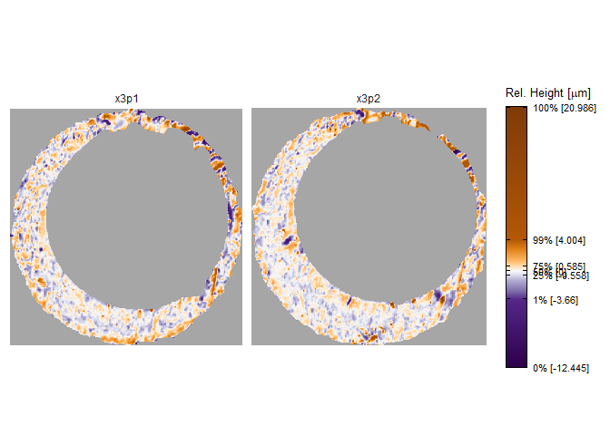

<!-- README.md is generated from README.Rmd. Please edit that file -->

# scored 

<!-- badges: start -->
<!-- badges: end -->

An R package to compare cartridge cases and compute similarity scores
based on their breech face impressions.

## Installation

You can install the development version of scored from
[GitHub](https://github.com/) with:

``` r
# install.packages("devtools")
devtools::install_github("jzemmels/scored")
```

## What the heck are you talking about?

A *cartridge case* is the metal casing that holds the projectile,
propellant, and primer of a cartridge (you might refer to them
colloquially as a “brass” or “shell”). When a firearm is discharged and
the projectile travels out of the barrel, the cartridge case pushes
against the back wall of the barrel, known as the *breech face*, with
great force. Markings on the breech face surface, attributable to
manufacturing, use, wear, etc., are “stamped” into the surface of the
cartridge case, leaving so-called *breech face impressions*. Analogous
to a fingerprint, forensic examiners have used these breech face
impressions to identify the firearm from which a cartridge case was
fired.

It is possible to capture digital representations, such as images or
topographic scans, of cartridge case surfaces and compare these
representations on a computer. We have developed a suite of tools
available in this R package for *automatically* comparing cartridge case
scans. The primary intended use of the `scored` package is to compute
numerical features between pairs of cartridge case scans that measure
the similarity of their breech face impressions.

## Feature calculation

As an example, consider two cartridge cases fired from the same handgun
(see [here](https://www.ojp.gov/pdffiles1/nij/249874.pdf) to learn
more). The cartridge cases are given unique character-based IDs
`K013sA1` and `K013sA2`. Because these cartridge cases were fired from
the same firearm, we assume that they share similar markings left by the
firearm barrel on their surfaces. The code below loads important
packages and the two cartridge cases.

``` r
library(scored)
library(impressions)
library(tidyverse)

data("K013sA1","K013sA2")
```

Below is a visual of the two cartridge case scans using the
`impressions::x3pPlot()` function. These scans have already undergone
some pre-processing to isolate the breech face impressions, but we skip
the details here. The similarity between these cartridge cases is not
immediately apparent. We can calculate similarity features between these
two scans using functions available in the `scored` package.

``` r
x3pPlot(K013sA1,K013sA2)
```



### Full-Scan Features

To compare the two cartridge case scans, we first try to align them by
determining the rotation/translation at which they are most similar.
This is a standard image processing technique called *registration* that
is implemented in the `comparison_fullScan()` function. The `thetas`
argument specifies one or more rotation angles (in degrees) that we want
to explore for possible registration. The `comparison_fullScan()`
function performs the registration in both “directions”, meaning it
first registers `K013sA2` to `K013sA1` and then registers `K013sA1` to
`K013sA2`. The `direction` column differentiates between these two sets
of results. The output is a data frame-like `tibble()` object containing
results of the registration process, which are discussed in greater
detail in the vignettes.

``` r
comparisonDat_fullScan_estimRotation <- comparison_fullScan(reference = K013sA1,
                                                            target = K013sA2,
                                                            thetas = seq(-30,30,by = 3))

head(comparisonDat_fullScan_estimRotation)
#> # A tibble: 6 × 12
#>   cellIndex     x     y fft_ccf pairwiseCompCor theta refMissingCount
#>   <chr>     <dbl> <dbl>   <dbl>           <dbl> <dbl>           <dbl>
#> 1 1, 1        -91  -130  0.0692          0.470    -30          126310
#> 2 1, 1         -6    -8  0.0654          0.0869   -27          126310
#> 3 1, 1        -87  -110  0.0632          0.363    -24          126310
#> 4 1, 1        -83   -99  0.0717          0.386    -21          126310
#> 5 1, 1        -77   -89  0.0684          0.351    -18          126310
#> 6 1, 1         19     8  0.0714          0.145    -15          126310
#> # ℹ 5 more variables: targMissingCount <dbl>, jointlyMissing <dbl>,
#> #   cellHeightValues <named list>, alignedTargetCell <named list>,
#> #   direction <chr>
```

``` r
comparisonDat_fullScan_estimRotation %>%
  group_by(direction) %>%
  feature_aLaCarte(features = "all")
#> Parameter 'eps' not specified. Defaulting to eps = 5.
#> Parameter 'minPts' not specified. Defaulting to minPts = 5.
#> Only one cell found. Skipping the density-based feature calculation.
#> Parameter 'threshold' not specified. Defaulting to threshold = 1.
#>             direction   ccfMean ccfSD pairwiseCompCorAve pairwiseCompCorSD
#> 1 reference_vs_target 0.2695168    NA          0.3998884                NA
#> 2 target_vs_reference 0.2718716    NA          0.4096494                NA
#>   xTransSD yTransSD thetaRotSD neighborhoodSizeAve_ave neighborhoodSizeAve_sd
#> 1       NA       NA         NA               113.09091                     NA
#> 2       NA       NA         NA                97.35443                     NA
#>   neighborhoodSizeSD_ave neighborhoodSizeSD_sd differenceCor_ave
#> 1               940.7352                    NA        0.07415392
#> 2               822.4063                    NA        0.08575254
#>   differenceCor_sd filteredRatio_ave filteredRatio_sd
#> 1               NA          4.752316               NA
#> 2               NA          4.858481               NA
```

### Cell-based features

``` r
comparisonData <- comparison_cellBased(reference = K013sA1,target = K013sA2,
                                       numCells = c(8,8),
                                       thetas = seq(-30,30,by = 3),
                                       direction = "both",
                                       returnX3Ps = TRUE)

comparisonData %>%
  group_by(direction) %>%
  feature_aLaCarte(features = "all",eps = 5,minPts = 5)
#> Parameter 'threshold' not specified. Defaulting to threshold = 1.
#>             direction   ccfMean      ccfSD pairwiseCompCorAve pairwiseCompCorSD
#> 1 reference_vs_target 0.3015478 0.08546018          0.5411682         0.1543828
#> 2 target_vs_reference 0.2488325 0.07746423          0.5513807         0.1503855
#>   xTransSD yTransSD thetaRotSD thetaDiff translationDiff clusterSize clusterInd
#> 1 39.20518  37.7141   19.54130         0        1.159502          11       TRUE
#> 2 31.77217  26.2262   14.59369         0        1.159502          11       TRUE
#>   neighborhoodSizeAve_ave neighborhoodSizeAve_sd neighborhoodSizeSD_ave
#> 1                54.71608               22.58417               135.9947
#> 2                54.36036               20.13450               138.9213
#>   neighborhoodSizeSD_sd differenceCor_ave differenceCor_sd filteredRatio_ave
#> 1              41.95552         0.4287395        0.1986363          2.126379
#> 2              35.80590         0.3636990        0.2136124          2.218079
#>   filteredRatio_sd
#> 1         2.013289
#> 2         1.405319
```
