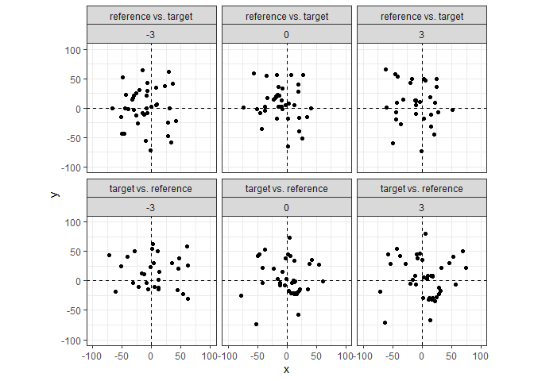

<!-- README.md is generated from README.Rmd. Please edit that file -->

# scored 

<!-- badges: start -->
<!-- badges: end -->

An R package to compare cartridge cases and compute similarity scores
based on their breech face impressions.

## Installation

You can install the development version of scored from
[GitHub](https://github.com/) with:

``` r
# install.packages("devtools")
devtools::install_github("jzemmels/scored")
```

## Feature Calculation

As an example, consider two cartridge cases fired from the same Ruger
SR9 semiautomatic 9-mm handgun. Learn more about the collection of these
cartridge cases [here](https://www.ojp.gov/pdffiles1/nij/249874.pdf).
The cartridge cases are uniquely identified as “K013sA1” and “K013sA2.”
We assume that the markings on these cartridge cases left by the handgun
during the firing process are similar.

``` r
library(scored)

library(cmcR)
library(impressions)
library(tidyverse)

data("K013sA1","K013sA2")
```

Below is a visual of the two cartridge case scans. Note that these scans
have already undergone some preprocessing to emphasize the breech face
impression markings. The similarity between these cartridge cases is not
immediately apparent. We can calculate similarity features between these
two scans using functions available in the `scored` package.

``` r
x3pPlot(K013sA1,K013sA2)
```


First, we compare the two scans using the cell-based comparison
procedure implemented in the `cmcR` R package. Briefly, this cell-based
comparison involves dividing one scan into a grid of “cells” and
identifying the rotation/translation at which each cell aligns best in
the other scan. This comparison is repeated in both directions: K013sA1
is divided into cells that are compared to K013sA2, and then K013sA2 is
divided into cells that are compared to K013sA1. The resulting
`comparisonData` data frame contains features related to the alignment
of each cell in the other scan. By itself, the features in
`comparisonData` are quite noisy – it’s difficult to measure the
similarity between K013sA1 and K013sA2. The `scored` package contains
functions that accept the `comparisonData` features as input and return
more informative similarity features.

``` r
comparisonData <- comparison_cellBased(reference = K013sA1,target = K013sA2,
                                       thetas = seq(-30,30,by = 3),
                                       returnX3Ps = FALSE)

comparisonData
#> # A tibble: 1,638 x 10
#>    cellIndex     x     y fft_ccf pairwis~1 theta refMi~2 targM~3 joint~4 direc~5
#>    <chr>     <dbl> <dbl>   <dbl>     <dbl> <dbl>   <dbl>   <dbl>   <dbl> <chr>  
#>  1 1, 2         24   -26   0.136     0.506   -30    2454   18481    2275 refere~
#>  2 1, 3         72   -37   0.148     0.388   -30    1150   16152    1109 refere~
#>  3 1, 4        -58     6   0.116     0.204   -30    1103   16846     531 refere~
#>  4 1, 5        -69   -25   0.209     0.431   -30    1450   19207    1351 refere~
#>  5 1, 6        -25   -13   0.294     0.519   -30    1751   21076    1336 refere~
#>  6 1, 7         33    15   0.234     0.483   -30    2401   22759    2101 refere~
#>  7 2, 1        -25   -49   0.161     0.550   -30    2498   17790      99 refere~
#>  8 2, 2          6   -63   0.134     0.176   -30     378   13973      54 refere~
#>  9 2, 3         40     8   0.174     0.602   -30    1912   13375       0 refere~
#> 10 2, 7         49    28   0.229     0.536   -30    2086   22466    1624 refere~
#> # ... with 1,628 more rows, and abbreviated variable names 1: pairwiseCompCor,
#> #   2: refMissingCount, 3: targMissingCount, 4: jointlyMissing, 5: direction
#> # i Use `print(n = ...)` to see more rows
```

### Registration-based Features

Briefly, the registration-based features are calculated using the
estimated alignment data from the comparison procedure. For truly
matching cartridge cases, we expect that cells from one scan will tend
to “agree” on a particular alignment (comprised of a rotation +
translation) at which they match the other scan. We measure how well a
cell “matches” to the other scan by considering the rotation/translation
at which the cross-correlation function (CCF) is maximized. A higher CCF
value corresponds to higher similarity. For truly matching cartridge
cases, we expect that the rotation/translation that maximize the CCF for
each cell will be close to one another (low variability). We also expect
the CCF to be large, on average.

The `feature_registration_all()` function calculates seven
registration-based features based on these expectations.

``` r
comparisonData %>%
  feature_registration_all()
#> # A tibble: 1 x 7
#>   ccfMean  ccfSD pairwiseCompCorMean pairwiseCompCorSD xTransSD yTransSD theta~1
#>     <dbl>  <dbl>               <dbl>             <dbl>    <dbl>    <dbl>   <dbl>
#> 1   0.275 0.0853               0.546             0.151     35.7     32.3    17.1
#> # ... with abbreviated variable name 1: thetaRotSD
```

We can calculate the same type of features, but this time based on a
comparison of the *full* scans to each other. That is, instead of
dividing the scans into a grid of cells and estimating the alignment for
each cell, we determine the translation/rotation that maximizes CCF
between the full scans. We expect the correlation to be large if the two
scans are truly matching.

``` r
comparisonDat_fullScan <- comparison_fullScan(K013sA1,K013sA2,returnX3Ps = FALSE)

comparisonDat_fullScan %>%
  feature_registration_all() %>%
  select(ccfMean,pairwiseCompCorMean)
#> # A tibble: 1 x 2
#>   ccfMean pairwiseCompCorMean
#>     <dbl>               <dbl>
#> 1   0.271               0.405
```

### Density-based Features

We re-iterate an expectation here for emphasis: we expect that cells
from one scan will tend to “agree” on a particular alignment (comprised
of a rotation + translation) at which they match the other scan. The
registration-based features rely on the CCF to measure how well a
cell/scan “matches” to another scan and considers the distribution of
features at which the CCF is maximized.

We can consider the notion of cell “agreement” through a different lens:
considering just the estimated registration values, are there regions in
rotation/translation,
"),
space where multiple cells seem to “bunch up?” The plot below shows the
estimated translations per cell across three rotation angles,
,
and both comparison directions. Note that the points in the “reference
vs. target” direction appear to bunch-up around

and
 = (-10,10)").
Conversely, the points in the “target vs. reference” direction bunch-up
around

and
 = (10,-10)").
This provides evidence that the scans are matching in two ways: (1)
multiple cells in both directions “agree” on a particular
rotation/translation and (2) the agreed-upon rotation/translation are
opposites of each other between the two comparison directions.

``` r
comparisonData %>%
  filter(theta >= -3 & theta <= 3) %>%
  ggplot(aes(x=x,y=y)) +
  geom_jitter() +
  facet_wrap(direction~theta,nrow =  2) +
  xlim(c(-100,100)) +
  ylim(c(-100,100)) +
  coord_fixed() +
  theme_bw() +
  geom_vline(xintercept = 0,linetype = "dashed") +
  geom_hline(yintercept = 0,linetype = "dashed") 
```



The notion of “agreement” is formalized using the point *density.* The
`feature_densityBased_all` function calculates three features related to
the number of cells that agree upon a particular rotation/translation
and whether the estimation rotations/translations are opposites of each
other between the two comparison directions.

``` r
comparisonData %>%
  feature_densityBased_all(eps = 5,minPts = 5)
#> # A tibble: 1 x 3
#>   thetaDiff translationDiff clusterSize
#>       <dbl>           <dbl>       <dbl>
#> 1         0            1.16          11
```

### Visual Diagnostic-based Features

More info coming soon…
